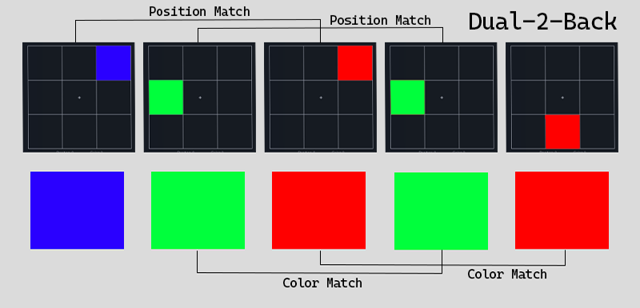
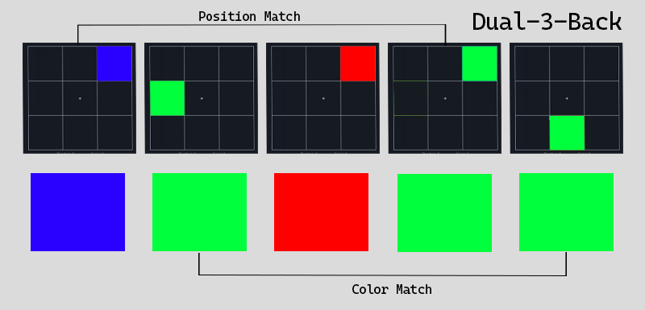

# Dual-N-Back

A Dual-N-Back Project made with HTML, CSS, and Javascript.

Dual-N-Back is a brain training game that supposedly trains the working memory. On the 3x3 grid, there will be a random colored square in a random position, that will show up on each grid cell.

### Preview

### Links

- Live Demo: [https://nevz9.github.io/dual-n-back/](https://nevz9.github.io/dual-n-back/)

### Built with

- HTML5 and CSS3
- Javascript DOM Manipulation
- Flexbox
- CSS Grid

### How to play

- How you match the position or color depends on the (n)-back  
  
  Like in the example above in Dual-2-Back. The
  first grid has a square on the 3rd cell, the second grid has a square on the 4th cell which is wrong, on the third grid, the square is on the 3rd cell again which matches.

  For the color, it is the same, the 2nd grid has a green colored square, the 3rd grid has a red colored square which doesn't match, and the 4th grid has a green colored square again which matches.

- For the position, you can click the position button or press A on the keyboard
- Same goes for the color, click the color button or press D on the keyboard

##

All thanks to The Odin Project, that I was able to create this project. This is not a project from the curriculum but personal.
